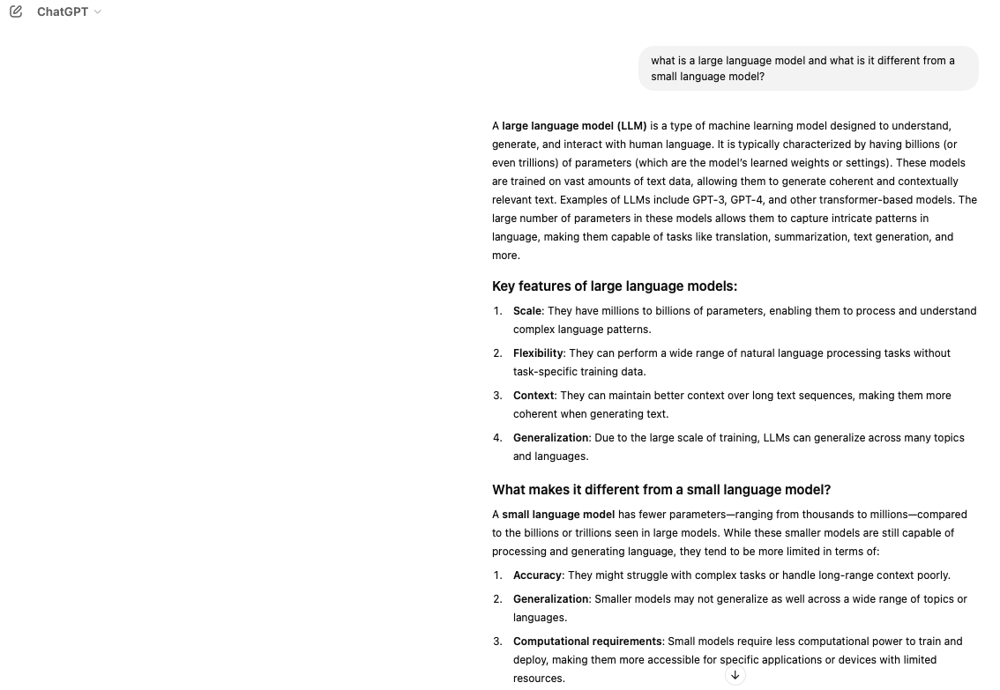

# Understanding LLMs / SLMs 

Let's start by understanding what a Large Language Model (LLM) is and then we can look at what a Small Language Model (SML) is.  What better way to find out than by asking ChatGPT!

## Small Language Models (SLMs)

"Small language models (SLMs) are artificial intelligence (AI) models capable of processing, understanding and generating natural language content. As their name implies, SLMs are smaller in scale and scope than large language models (LLMs)."

by Rina Diane Carallar  full article can be found [here](https://www.ibm.com/think/topics/small-language-models#:~:text=Small%20language%20models%20(SLMs)%20are,large%20language%20models%20(LLMs).)

## Comparison of LLMs and SLMs

|             Attribute            |                 LLM                |                    SLM                   | 
|.................................:|...................................:|.........................................:|
| Typical Size                     | billions to trillions of paramaters| few million to several billion paramaters|
| Accessibility                    | require multiple GPUs              | require less GPUs                        |
| Latancy                          | Higher                             | Lower                                    |
| Sustainability |Higher Carbon Footprint| Lower Carbon Footprint|