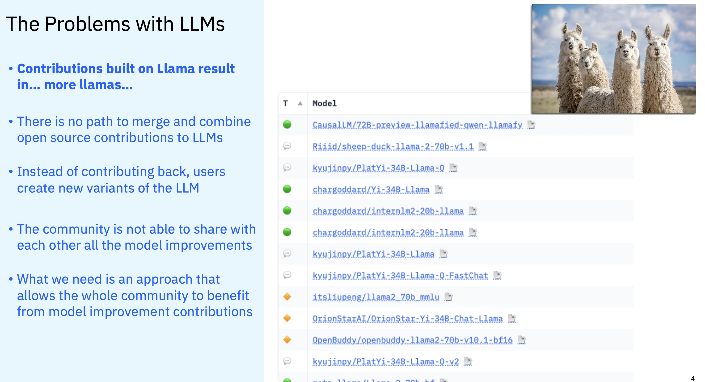

# Open Source vs Proprietary

**Open source software (OSS)** is source code developed and maintained through open collaboration. Anyone can use, examine, alter and redistribute OSS as they see fit, typically at no cost.

**proprietary or closed source software applications** such as Microsoft Word or Adobe Illustrator. The creator or copyright holder sells the proprietary or closed source software to end users, who are not allowed to edit, enhance or redistribute the product except as specified by the copyright holder.

[for the full article click here](https://www.ibm.com/think/topics/open-source#:~:text=With%20open%20source%2C%20the%20IP,subscription%20or%20proprietary%20license%20fee.)

---

