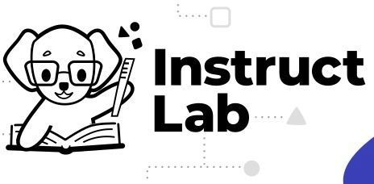

# Overview of objectives
    
- ### Understand LLM/SLMs and the challenges associated with updating them 
- ### Understand InstructLab Methodology 
- ### Understand the InstructLab Taxonomy/Skills/Knowledge
- ### Understand Synthetic Data Generation and how we train InstructLab
- ### Understand the relevance of open source and communitity driven project
- ### Hands on experience of InstructLab
- ### Achieve InstructLab badge

