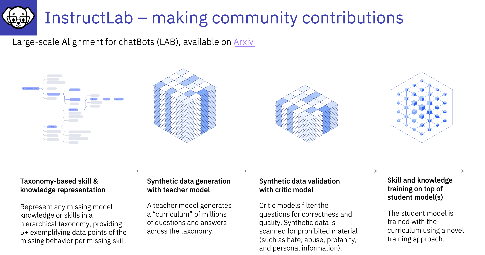
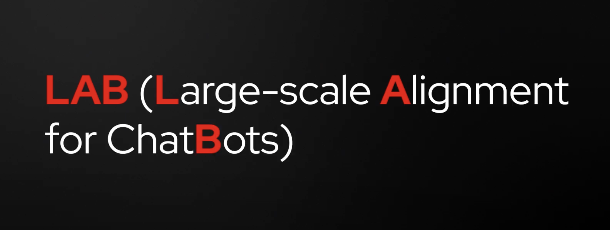

# The LAB Paper

## :bulb:Large-scale Alignment for chatBots (LAB) Concepts

A faster, systematic way to train large language models for the enterprise!

**Please note:** We will cover the topic's on this page during this course as we delve in to how to tune an LLM with InstructLab

---
**Large-scale Alignment for chatBots, or LAB**. Is a method for systematically generating synthetic data for the tasks you want your chatbot to accomplish, and for assimilating new knowledge and capabilities into the foundation model, without overwriting what the model has already learned. With LAB, Language Models can be drastically improved in far less time and at a lower cost than is typically spent training Language Models. **:bulb:This is the only method to enable community-driven development and model evolution**

---
## High-level overview of the LAB paper (video)

:bulb:IBM and Red Hat\'s new open source project is designed to lower the cost of customizing Language Models by allowing end users, subject matter experts, and enterprises to collaboratively add new knowledge and skills to AI language models which democratize AI building for everyone.

## Additional Reading

[Link to the Lab Paper](https://arxiv.org/abs/2403.01081)

[systematic way to train large language models for enterprise](https://research.ibm.com/blog/LLM-generated-data)
by [Kim Martineau](https://research.ibm.com/people/kim-martineau) 

