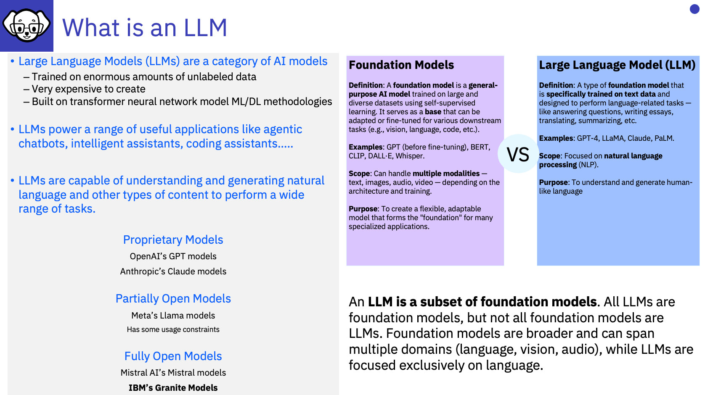
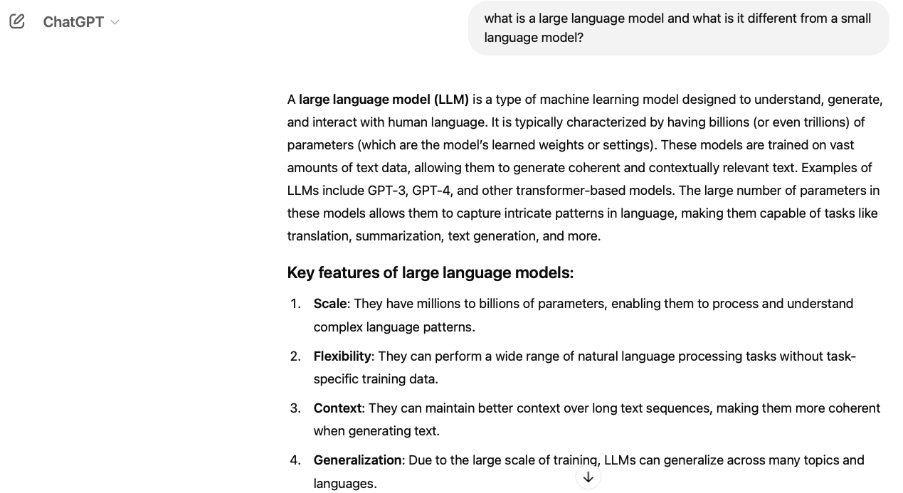

# What is an LLM / SLM

Let's start by understanding more about Language Model (LLMs) and Small Language Models (SMLs). 

---

# Let's see what ChatGPT has to say about LLMs!

Of course, ChatGPT is not the only LLM, however, it was the first one release commercially!

