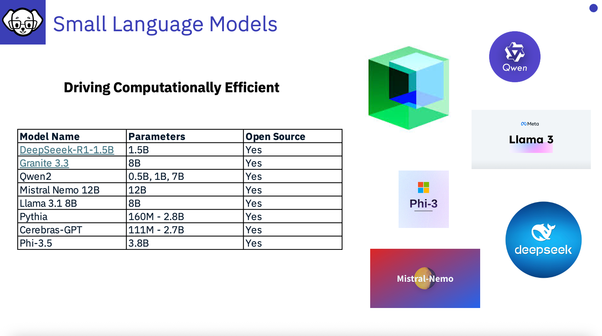

# Small Language Models

---

"Small language models (SLMs) are artificial intelligence (AI) models capable of processing, understanding and generating natural language content. As their name implies, SLMs are smaller in scale and scope than large language models (LLMs).”

[What are small language models](https://www.ibm.com/think/topics/small-language-models#:~:text=Small%20language%20models%20(SLMs)%20are,large%20language%20models%20(LLMs).) by [Diane Carallar](https://www.ibm.com/think/author/rina-diane-caballar.html)

## About SLM's

Small Language Models although they contain less information are often focused on a specific field or set of topics.  Due to their smaller nature, they can be much more efficient to work with.   The Granite model uses 97% less energy than the largest LLMs, and is designed to be small and for purpose, containing curated information. 

In 2025 Small Language Models, have become more prevalent in the market.  They provide many benefits, such as lower costs for inferencing, requiring less compute power, being focused on specific topics. **DeepSeek**, notably came into the spotlight at the start of 2025 showing that a small LLM can be very impactful!

LLMs have predominantly been trained with publicly available information, however, they have not been trained with data from organisations, so they do not bring their benefits to organisations, without being augmented or trained which can be costly. 

If you want to find out more about an SSL - Check out Granite - IBM’s **open source based family of LLMs** at https://www.ibm.com/granite 

[Check out the Granite family of Models](https://www.ibm.com/granite)

## Other SLM's

**Qwen**
This is the organization of Qwen, which refers to the large language model family built by Alibaba Cloud. In this organization, we continuously release large language models (LLM), large multimodal models (LMM), and other AGI-related projects. Feel free to visit Qwen Chat and enjoy our latest models!

**Mistral NeMo**: a smalllLanguage model. A state-of-the-art 12B model with 128k context length, built in collaboration with NVIDIA, and released under the Apache 2.0 license.

**DeepSeak**
Hangzhou DeepSeek Artificial Intelligence Basic Technology Research Co., Ltd., doing business as DeepSeek, is a Chinese artificial intelligence company that develops large language models. Based in Hangzhou, Zhejiang, it is owned and funded by the Chinese hedge fund High-Flyer.

**TeraMind**
IBM and the European Space Agency (ESA) launched in April 2025 TerraMind, a new open-source AI model with an “intuitive” understanding of Earth. According to the research team, the system is the best-performing AI model for Earth observation.
HuggingFace: https://lnkd.in/eTzZp7ZB \
Blog: https://lnkd.in/er9iMy6h \
Paper: https://lnkd.in/e2yGeqAp \
And watch the IBM Granite space (https://lnkd.in/eM-C6DTB) where we are going to be releasing finetuned versions for climate resilience! \

