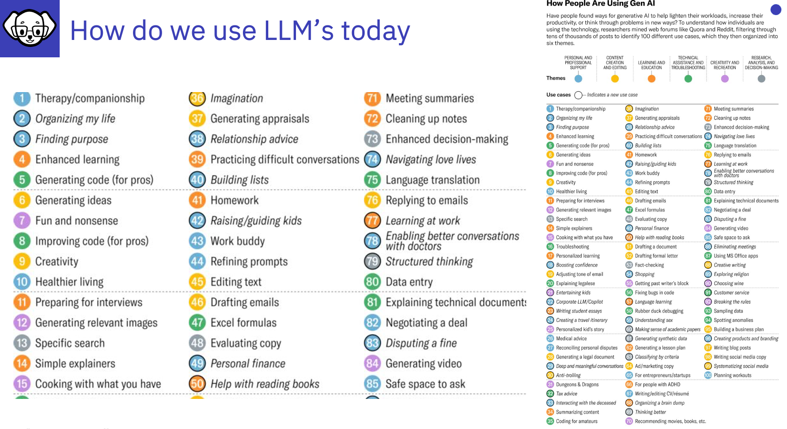

# How do we use LLMs - Why might we want to tune them?

In 2025 this is what people typically use LLM's for - there are many articles on the topic - this is taken from an article by [Generative AI](https://www.linkedin.com/company/genai-works) showing that the top 5 trends for using GenAI LLMs are:

1. Therapy and companionship
2. Organizing my life
3. Finding purpose
4. Enhanced learning
5. Generating code (for pros)

---

*Click on the image for the full LinkedIn post*
---

# How can businesses benefit from LLM's or SLM's?

Businesses can utilise Large or Small Language Models in a many ways such as:
- automating customer service, 
- generating content, 
- analyzing data, 
- improving internal processes 
- translation, 
- fraud detection,

the list goes on.

However there is a challenge as LLM's do not contain businesses data as it is typically private and not publicly available!  Of course it is feasible to augment an LLM with Retrieval Augmented Generation (RAG), but imagine if those businesses could create their own private tuned model easily....

**InstructLab can enable them to add thier own private Knowledge and Skilly to their own in house LLM or SLM**