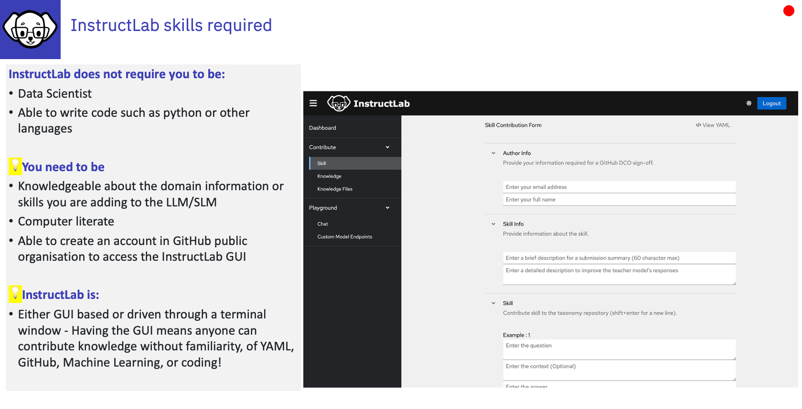

# InstructLab and how it helps

:bulb:
InstructLab is an **open-source project** originating from IBM Research and Red Hat that enables **community-driven customization and tuning of large language models (LLMs)** for generative AI applications, focusing on **accessibility, cost-effectiveness, and providing a broader coverage of target tasks** . It **democratizes model tuning** and drive community development of LLMs and for businesses, enabling them to easily customise their in house LLM!

---

# What InstructLab enables businesses to do

- Add thier propriatory data to their own model - that is only available to who they choose to share it with
- Provides a means to easily add their knowledge (manuals, HR processes, procedures)
- Enables them to add skills (how to guides, translate company specific acronyms)
- Provides some ability to control and govern the development of their in-house LLM
- Enables the organisation to capture the providence of information added to the model 

---

