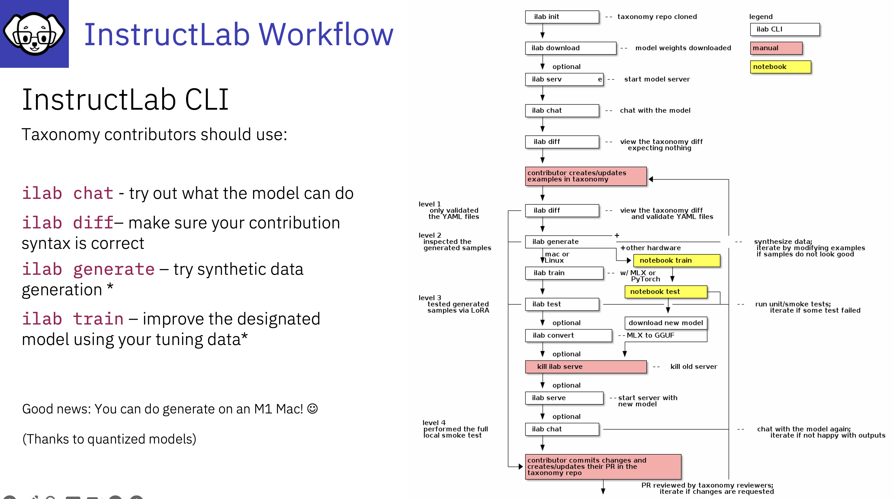

# 10 Simple steps to train an LLM with InstructLab

1. Write prompts and ask questions utilise the knowledge and skills the LLM has.
2. Identify the gap in knowledge/skills
3. Collate data
4. Create qna.yaml fine
5. Create the attribution file
---
6. run **ilab taxonomy diff** to check for new information in the InstructLab Taxonomy
7. run **ilab generate** to create SDG
8. run **ilab train** to train your model 
9. run **ilab test** to run a smoke test
10. run **ilab convert** to create a new GGUF file
---
Now you can serve your new model and chat with the new knowledge and skills

---

---

