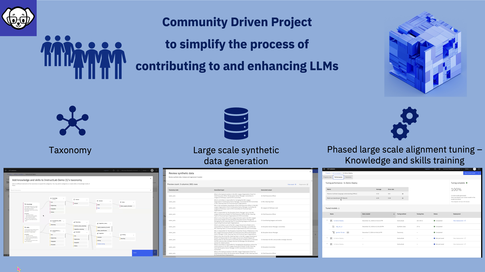

# Introducing InstructLab

---

Large Language Models (LLMs) are the new frontier in data insights, but they are only as knowledgeable as the information they contain. We live in a data-driven world, where new information is generated every second. For organizations and enterprises, data is stored internally, meaning that to fully leverage an LLM, these organizations need to integrate their proprietary data into their private LLM. However, customizing or tailoring LLMs has been a significant challenge. This is where InstructLab comes in to overcome that challenge and much more.

InstructLab enables a prescriptive approach to LLM development, allowing individuals to define what a model knows and what it can do using a taxonomy.

Prior to InstructLab, new knowledge could only be added to a model via Fine Tuning, which is costly and resource-intensive. To address this, InstructLab provides a multi-phased, large-scale alignment tuning process that enables you to integrate knowledge that you Syntheticly Generate.

InstructLab is an open-source project, which means not only can you contribute to its development, but you can also play a part in the ongoing evolution of LLMs in a controlled and governed manner.

Before we dive into the details of InstructLab, let’s explore how we got here!
