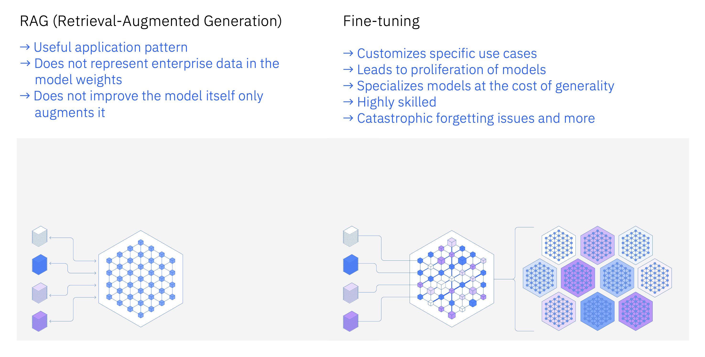
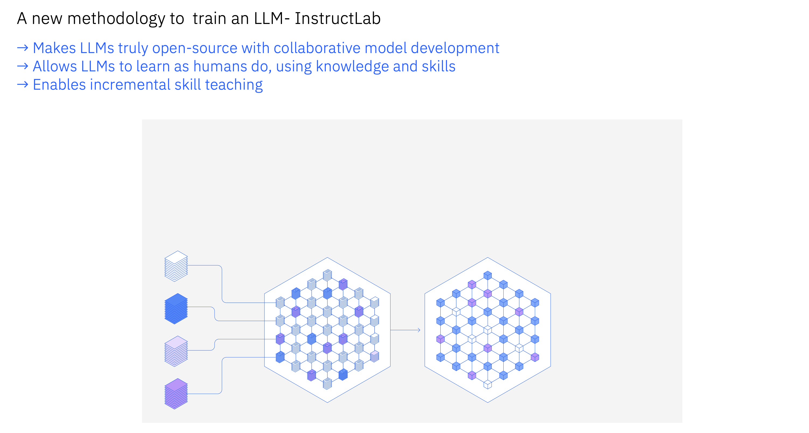
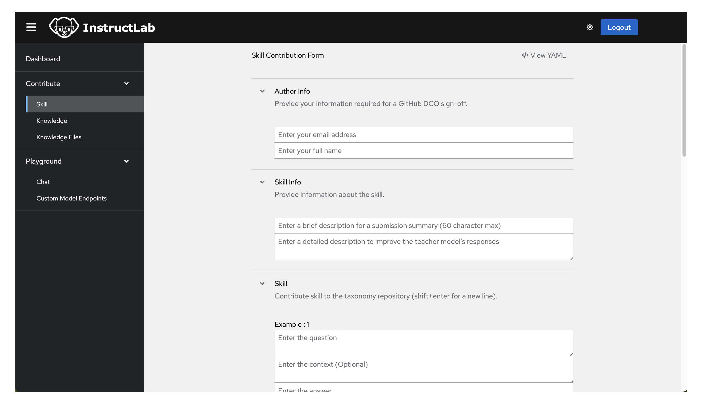

# Democratizing GenAI  - Skills

To understand how LLM/SLM tuning is being democratized we need to understand how we tune models today 

## Fine Tuning / RAG / InstructLab Method

***

## InstructLab does not require you to be:
- **Data Scientist**
- **Able to write code such as python or other languages**

## You need to be
- **knowledgeable about the knowledge or skills you are adding to the LLM/SLM**
- **computer literate**

## InstructLab is:
- **Either GUI based or driven through a terminal window**

