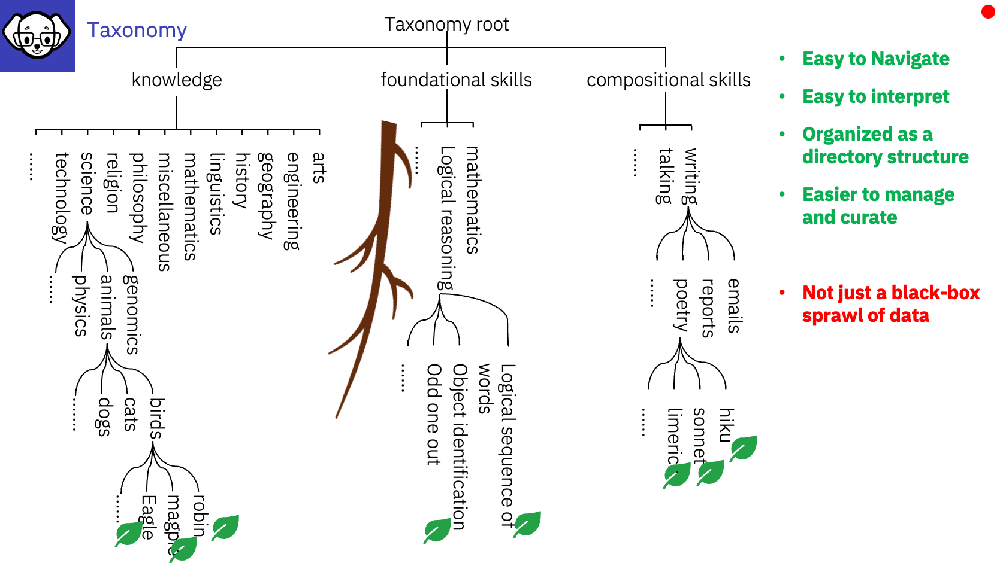

# InstructLab Taxonomy

# :bulb: The InstructLab LAB Method:
### - is driven by taxonomies, which are largely created manually and with care.
### - has a repository that contains a taxonomy tree (heriarchical map) that allows you to create models tuned with your data (enhanced via synthetic data generation) using the LAB 🐶 method.
### - when contributing Knowledge or Skills back to the community you should add to the Taxomony system following the [Dewey Decimal Classifications DDC](https://www.oclc.org/content/dam/oclc/dewey/resources/summaries/deweysummaries.pdf)

For more informaiton on the Taxonomy please refer to the [InstructLab github page](https://github.com/instructlab/taxonomy?tab=readme-ov-file#taxonomy-tree-layout)