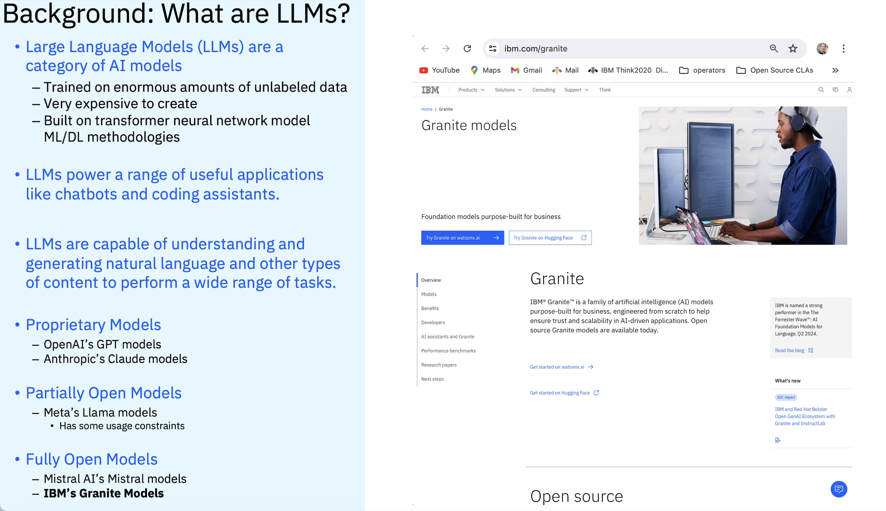

# Understanding LLMs and SLMs 
***

## Small Language Models (SLMs)

"Small language models (SLMs) are artificial intelligence (AI) models capable of processing, understanding and generating natural language content. As their name implies, **SLMs are smaller in scale and scope than large language models (LLMs)**."

Quote by Rina Diane Carallar full article can be found [here](https://www.ibm.com/think/topics/small-language-models#:~:text=Small%20language%20models%20(SLMs)%20are,large%20language%20models%20(LLMs).)

Small Language Models althought they contain less information are often focused on a specific field or set of topics.  Due to their smaller nature, they can be much more efficent to work with.   The Granite model uses 97% less energy than the largest LLMs, and is designed to be small and for purpose, containing curated information. 

***

