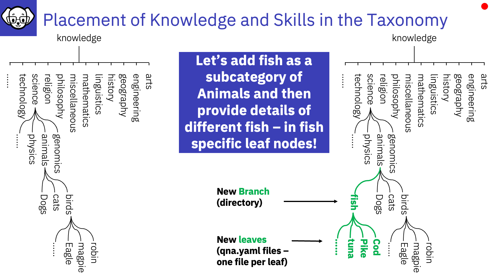

# Placement of Knowledge and Skills in the Taxonomy Tree

## Contributing skills and knowledge

[For more details in InstructLab GitHub documentation](https://github.com/instructlab/taxonomy/blob/main/CONTRIBUTING.md#ways-of-contributing-to-the-taxonomy-repository)

You can contribute to the taxonomy in the following two ways:

**1. Adding new examples to existing leaf nodes**

- Go to the corresponding leaf node / end of the branch and modify the YAML in the existing leaf node
- Add a new example to the qna.yaml files as a new entry to the list

**2. Adding new a new branches/leaf nodes corresponding to the existing domain:**

- You can add new folders under the corresponding category 
- Add new qna.yaml file/s containing examples for the new knoweledge or skill

