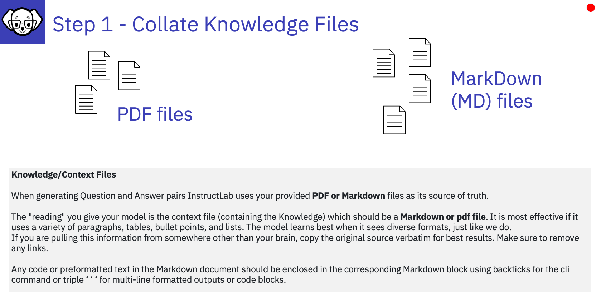

# Step 1 - Collate Knowledge files

---
Taken from "[Best Practices for InstructLab instruction datasets](https://developers.redhat.com/articles/2024/11/21/best-practices-instructlab-instruction-datasets)" by [Legare Kerrison](https://developers.redhat.com/author/legare-kerrison)
