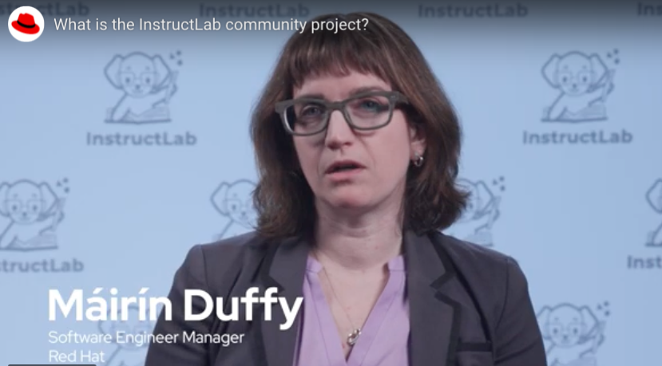

# Open Source and InstructLab

InstructLab is an open source project for customizing large language models (LLMs) and small language models (SLMs). Developed by IBM and Red Hat, InstructLab provides a cost-effective solution to improve alignment of language models and opens doors to those with minimal machine learning experience to contribute to customizing language models.

Join Máirín Duffy from Red Hat to explore:
- the challenge of contributing to an AI model 
- how anyone can contribut knowledge and skills to a model
- what Makes InstructLab open source
- how anyone can be part of this open source community

