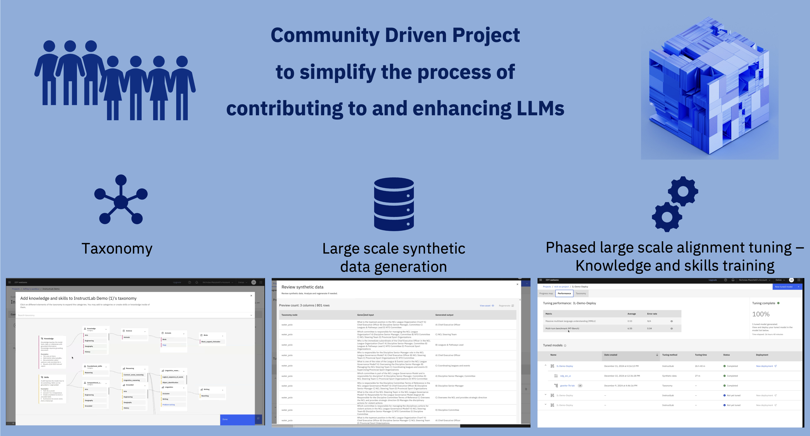

# InstructLab 

# Links to some papers, blogs, and videos, that provide an overview of InstructLab

[How InstructLab’s synthetic data generation enhances LLMs](https://www.redhat.com/en/blog/how-instructlabs-synthetic-data-generation-enhances-llms)
by [Cedric Clyburn](https://www.redhat.com/en/authors/cedric-clyburn), and [Legare Kerrison](https://www.redhat.com/en/authors/legare-kerrison)

[Video of Ope Source Community Instruction-tuning of Large Lanaguage Models](https://www.youtube.com/watch?v=l-Nq2b8Y-mA)
presented by [BJ Hargrave](https://www.linkedin.com/in/bjhargrave/)