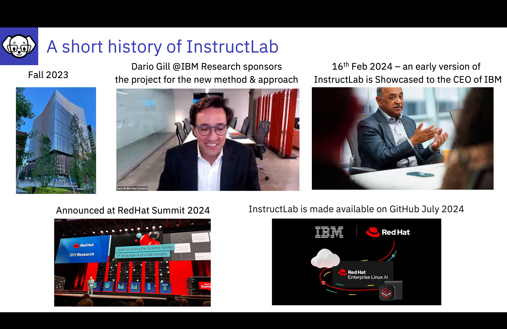

# History of InstructLab

From IBM Research to RedHat and the world of Open Source

---

The Instruct Lab Technique was developed by the team at Cambridge AI Model Research in the fall of 2023. Dario Gill, Head of IBM Research, quickly recognized the potential of this innovative methodology for tuning large language models. Enthusiastic about its possibilities, Dario presented the technique to Arvin and his senior leadership team on February 16th of this year. The response was overwhelmingly positive, with excitement about how Instruct Lab could enhance both IBM models and the broader open models ecosystem.

This momentum was further accelerated with support from RedHat, leading to a joint announcement at the RedHat Summit just 81 days later, in early May 2023.

Today InstructLab is available as an Open Source offering for all to use to add/tune models.  Or for individuals to contiribute to the development of InstructLab.

The focus of InstructLab is to democratize the modification of Foundation Models through this community driven initiative. 