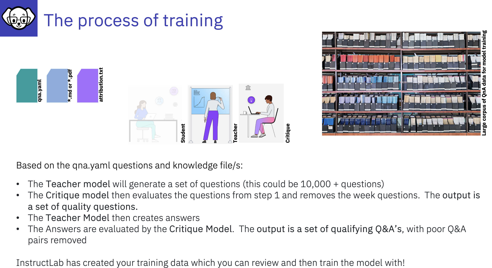
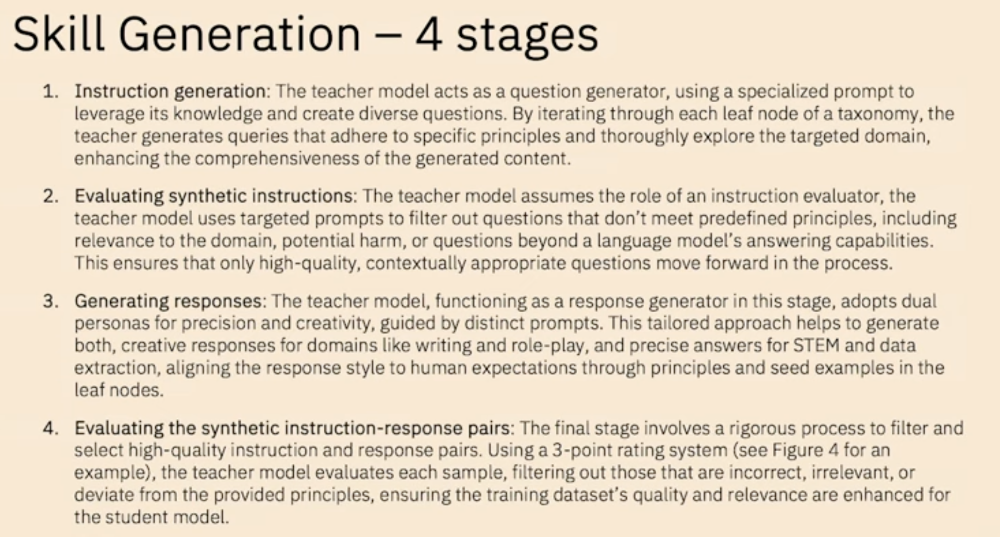
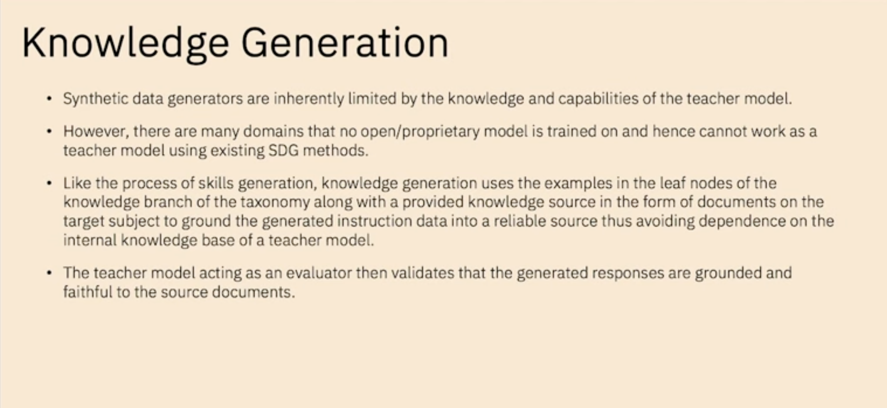

# Synthetic Data Generation Process 

Synthetic Sata Generation (SDG) is a little bit like following a recipie!

We have:
- A Student model - who learns about the new data (typically a smaller model)
- A Teacher Model - which is preferably a big model to create the synthetic data 
- A Critique Model - to evaluate the newly synthetically generated data

- we need our *'recipie files'* qna.yaml, *.md, and attribution.txt

---

---
## Automated refinement

The LAB method incorporates an automated refinement process to improve the quality and reliability of synthetically generated training data. Guided by a hierarchical taxonomy, it uses the model as both a generator and evaluator. The process includes instruction generation, content filtering, response generation and pair evaluation using a 3-point rating system. For knowledge-based tasks, generated content is grounded in reliable source documents, addressing potential inaccuracies in specialized domains.

for more details [How InstructLab’s synthetic data generation enhances LLMs](https://www.redhat.com/en/blog/how-instructlabs-synthetic-data-generation-enhances-llms)
by [Cedric Clyburn](https://www.redhat.com/en/authors/cedric-clyburn), and [Legare Kerrison](https://www.redhat.com/en/authors/legare-kerrison)

---

1. InstructLab leverages a Teacher Model to generate new Question and Answer pairs (based on the seed examples in the qna.yaml file supported by any documents *.md, and *.pdf)
    - The training does not use knowledge stored by the Teacher Model
    - The method utilizes particular prompt templates that dramatically expand the dataset
    - InstructLab makes sure that the new examples maintain the structure and intent of the origninal human-curated data 

- with a Taxonomy model it is feasible to ensure that you flatten out the SDG accross all topics so your data is not skewed, you want to avoid having a peak of data in an aread where the Teacher model has excellent knowledge - also providing and good distributed set of data in the input will promote this.

---

## Stages of Skill generation
1. Questions - the teacher will generate a set of questions
2. The critique model must then evaluate the question in step 1 and weed out the week questions
** output is a set of quality questions**
3. The teacher then creates answers 
4. The Answers are then envaluated by the critique model. 
** output is a set of quality questions**

---

## Knowledge Generation 
The questions and answers are grounded in documents. Then we go through to generating Q&A phase
1. Questions - the teacher will generate a set of questions
2. The critique must then evaluate the question in step 1 and weed out the week questions
** output is a set of quality questions**
3. The teacher then creates answers 
4. The answers are then envaluated by the cirtique model. 
** output is a set of quality questions**

---

---

 Refer to ['Large-scale synthetic data generation' section of What is InstructLab and why do developers need it by Syeda Ameena Begum](https://developer.ibm.com/articles/awb-instructlab-why-developers-need-it/#large-scale-synthetic-data-generation2)

