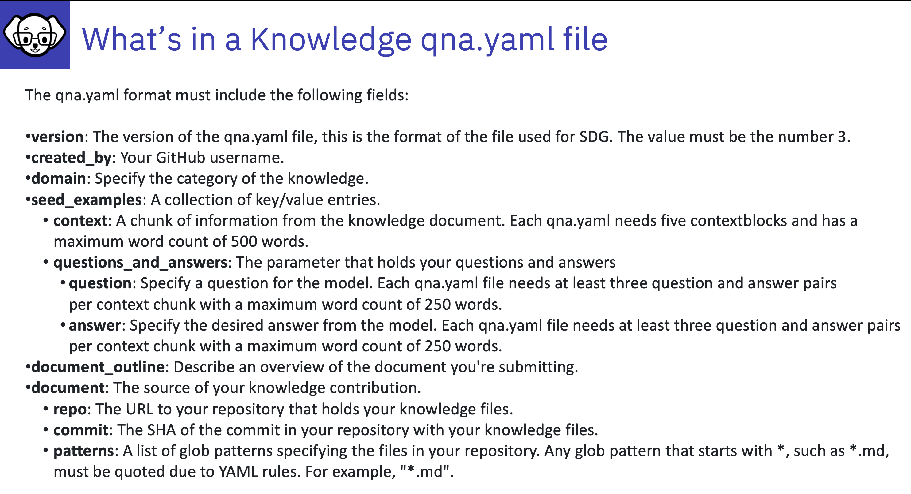

# What's in a Knowledge qna.yaml file

Details from 

1. [version]: The version of the qna.yaml file, this is the format of the file used for SDG. The value must be the number 3.

2. [created_by]: Your GitHub username.

3. [domain]: Specify the category of the knowledge.

4. [seed_examples]: A collection of key/value entries.

    i. [context]: A chunk of information from the knowledge document. Each qna.yaml needs five context blocks and has a maximum word count of 500 words.

    ii. [questions_and_answers]: The parameter that holds your questions and answers

        a.[question]: Specify a question for the model. Each qna.yaml file needs at least three question and answer pairs per context chunk with a maximum word count of 250 words.

        b. [answer]: Specify the desired answer from the model. Each qna.yaml file needs at least three question and answer pairs per context chunk with a maximum word count of 250 words.

5. [document_outline]: Describe an overview of the document your submitting.

6. [document]: The source of your knowledge contribution.

        i. [repo]: The URL to your repository that holds your knowledge markdown files.

        ii. [commit]: The SHA of the commit in your repository with your knowledge markdown files.

        iii. [patterns]: A list of glob patterns specifying the markdown files in your repository. Any glob pattern that starts with *, such as *.md, must be quoted due to YAML rules. For example, *.md.