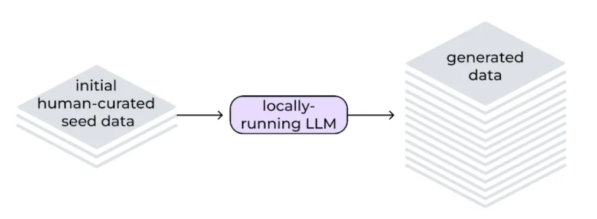

# Multi-phase Training

Training happens in 2 phasees 
1. Knowledge - which is split into two steps:
    - Knowledge with short responses
    - knowledge with long responses

2. Compositional Skills

**Replay buffers** are ued to replay training data from previous steps during the current training step **to avoid catastrophic forgetting**

