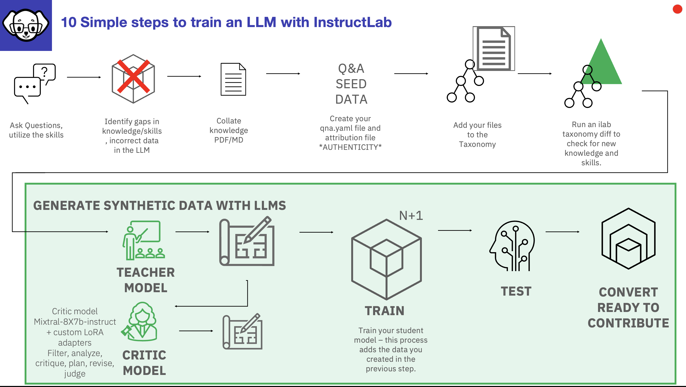

# Synthetic Data Generation and Tuning a Model

In this section we will look at:
- Synthetic Data Generation and associated Challenges 
- Synthetic Data Generation Advantages.
- The InstructLab SDG Process
- The Models used
- Multiphase Tuning
- Replay Buffers and Catastrophic Forgetting
- Quantized models and GUFF files
- How good is InstructLab?
- How to contribut knowledge and skills to a model
---
## In this section we will look at Synthetic Data Generation (SDG) and Training as highlighted in green below

