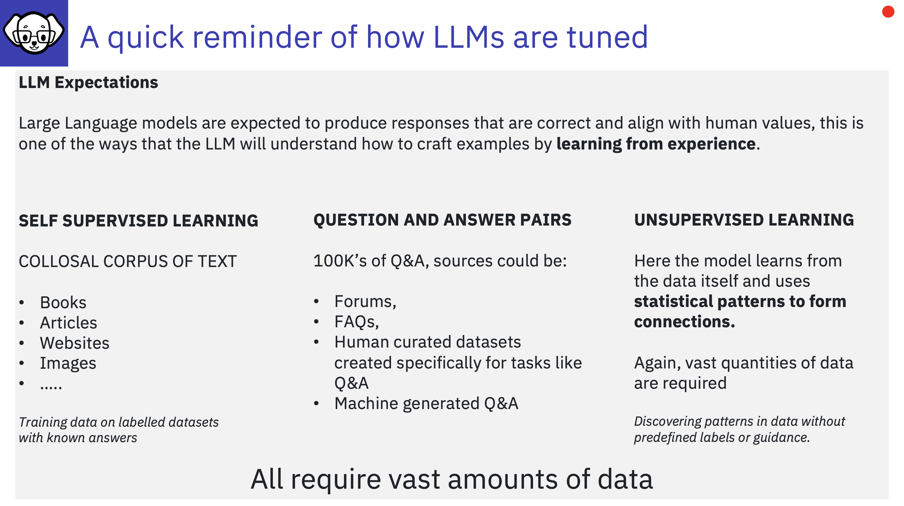

## Synthetic Data Generation

SDG is important as Large Language Models are expected to produce responses that align with human values and that are correct, this is one of the ways that the model will understand how to craft examples by learning from experience.
---

---

## How models are tuned

Model's are generally trained using Self-Supervised learning, from vast amounts of text data without explicit human-labelled answers. 

- **Self-Supervised Learning:** During training, the model is fed with a large corpus of text (which could include books, articles, websites, etc.). In self-supervised learning, the model doesn't need labelled pairs of questions and answers. Instead, it learns to predict the next word in a sequence based on context, or in some cases, it might predict missing words in a sentence. This process doesn't require manually curated question-answer pairs but rather relies on the structure of the language itself.

- **Training on Question-Answer Pairs:** While the model is trained on a huge range of text, some of this data can include question-answer pairs (from sources like forums, FAQs, or datasets created specifically for tasks like QA). The model learns to associate questions with possible answers in a way that generalizes to answering a wide variety of questions. But this is still part of the broader language modelling process, which doesn't rely solely on QA pairs.

- **Unsupervised Aspect:** The "unsupervised" part comes from the fact that the model isn't explicitly given human-labelled supervision like, "this is the right answer for this question." Instead, it learns from the data itself and uses statistical patterns to form connections.

**With InstructLab**, The tuning/training phase utilises the Synthetically Generated Data (SDG), which is in the form of Questions and Answer pairs along with any knowledge files that have been provided.

---

