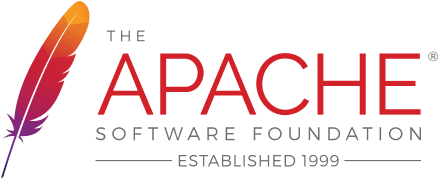

# Apache 2.0 Licence for InstructLab and Granite

# Software for the public good

## A permissive free software licence that permists use of thesoftware for any purpose. 

## Uses can:

- ## use the software for any purpose
- ## distribute the software
- ## modify it
- ## distribute modified versions of the software

---

